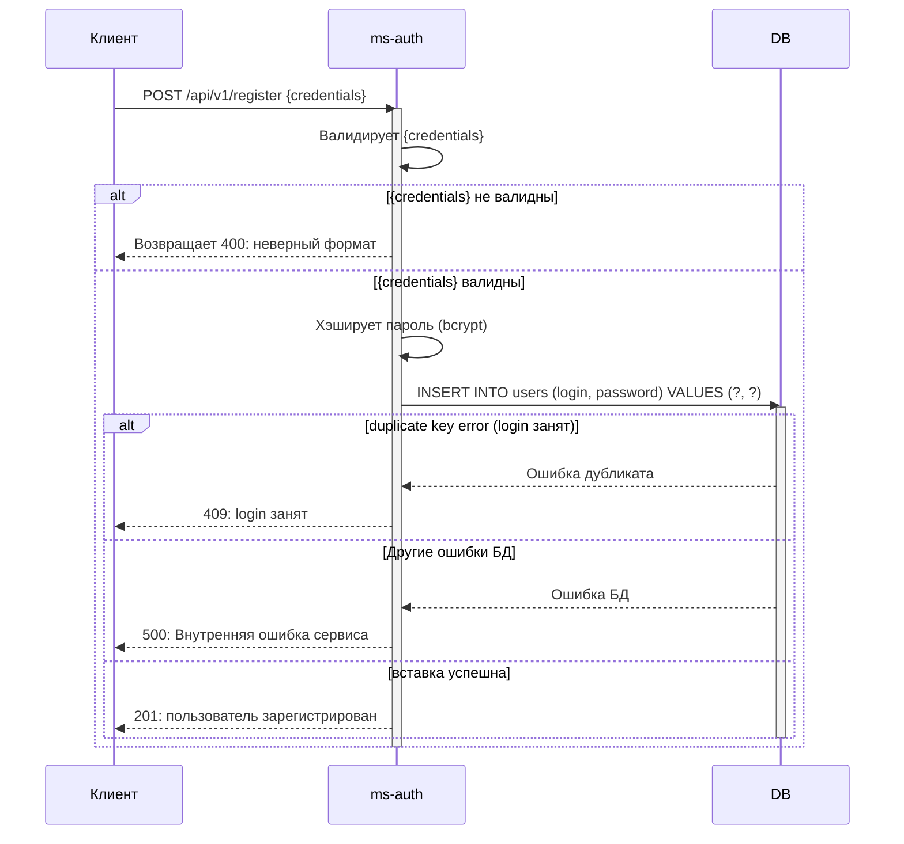

# Сервис авторизации (ms-auth)

Простой сервис авторизации и аутентификации, реализованный на **Java 21** с использованием **Spring Boot**, **Spring Security** и **JWT**.  
Предназначен для управления пользовательскими сессиями с возможностью инвалидации токенов через blacklist.

## Оглавление

todo

## Основные возможности

- **Регистрация пользователя**  
  `/register` – принимает логин и пароль, сохраняет учётную запись в системе.

- **Вход в систему**  
  `/login` – проверяет переданные креды, выдаёт пару **access** и **refresh** токенов (JWT).

- **Выход из системы**  
  `/logout` – аннулирует текущие токены, добавляя их **jti** (JWT ID) в blacklist. Последующие запросы с этими токенами будут отклонены.

- **Ротация access‑токена**  
  `/refresh` – принимает валидный refresh‑токен, выдаёт новый access‑токен (и опционально обновляет refresh).

## Диаграммы

### Регистрация пользователя

## Стэк

todo

## Установка

todo
